<div align="center">
  <h1>AIRO Flatness</h1>
  <p><b>3D 포인트 클라우드 기반 바닥 평탄도 분석 시스템</b></p>
  <p>LiDAR 스캔 데이터(PLY)를 로딩하여 바닥면을 자동 추출하고,<br>평탄도 분석 및 시각화 리포트를 생성합니다.</p>
</div>

---

## 주요 기능

- **대용량 PLY 스트리밍 로딩** — 27GB+ 파일도 청크 단위 스트리밍 + 랜덤 샘플링으로 메모리 효율적 처리
- **3단계 하이브리드 바닥 추출** — Z-히스토그램 피크 감지 → Z-필터링 → Intensity/Color 정제
- **바닥 평탄도 분석** — 그리드 기반 SVD 표면 법선 추정으로 셀별 기울기 계산
- **GPU 가속 3D 시각화** — PyVista 기반 4가지 뷰 모드 + 5방향 스크린샷 캡처
- **7종 분석 차트 자동 생성** — Z-히스토그램, 필터링 퍼널, 평탄도 히트맵 등
- **JSON 리포트** — 분석 메타데이터, 파라미터 민감도, 평탄도 통계 포함

---

## 분석 결과 예시

### 3D 포인트 클라우드 시각화

> 바닥 영역이 빨간색으로 하이라이트된 전방 뷰 (Mode 4: Highlighted Floor)

| Before | After |
|:---:|:---:|
| 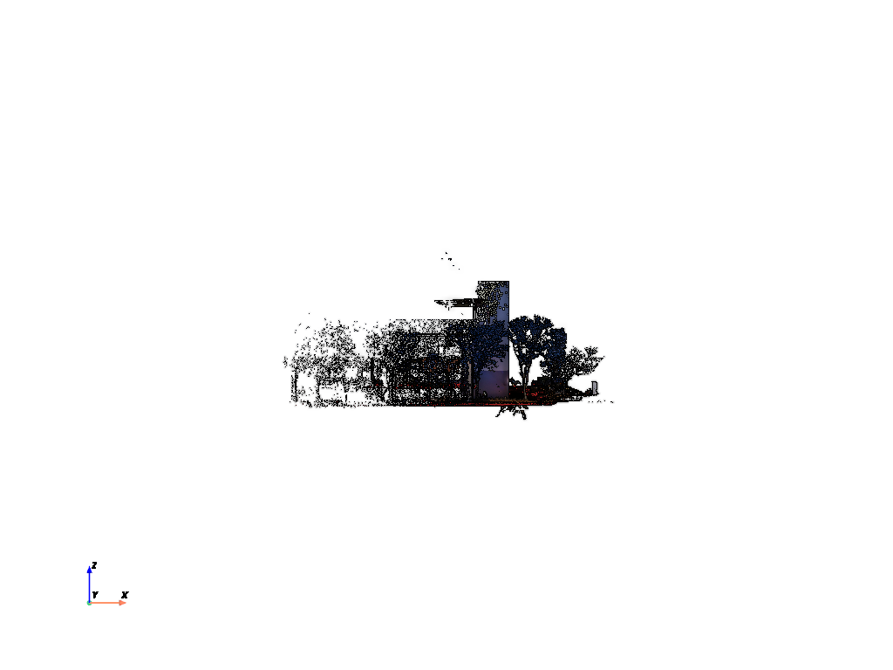 | 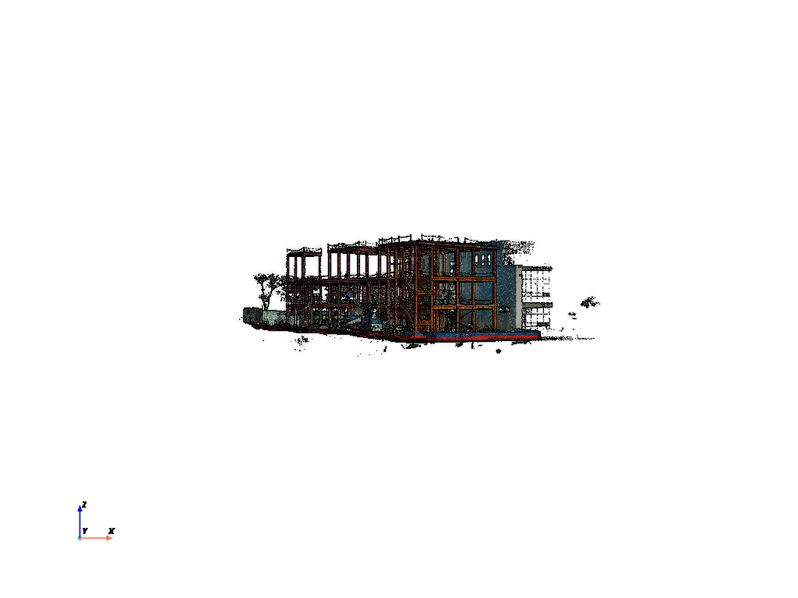 |

<details>
<summary>전체 포인트 클라우드 (Mode 1: Full Point Cloud)</summary>

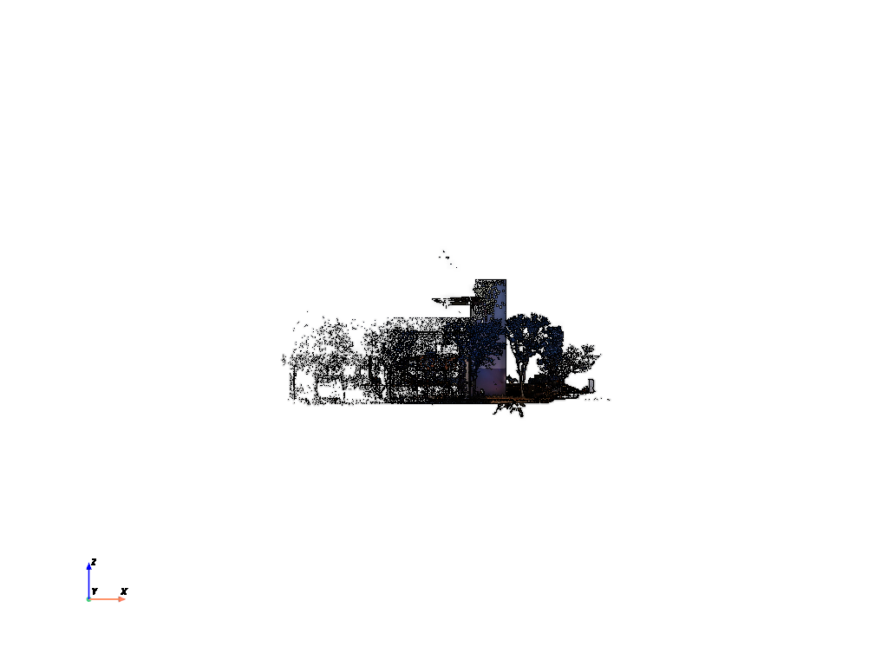

</details>

### 바닥 추출 분석

#### Z-히스토그램 피크 감지

> Z축 분포에서 바닥면 피크를 자동 감지하고, FWHM 기반으로 바닥 범위를 결정합니다.

| Before | After |
|:---:|:---:|
| 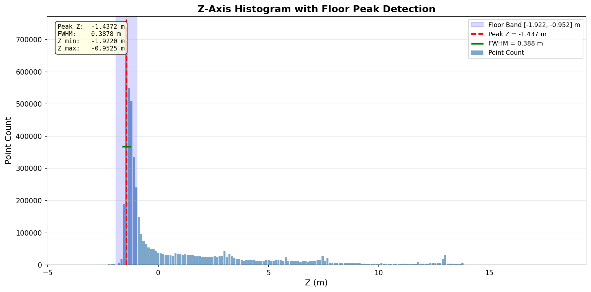 | 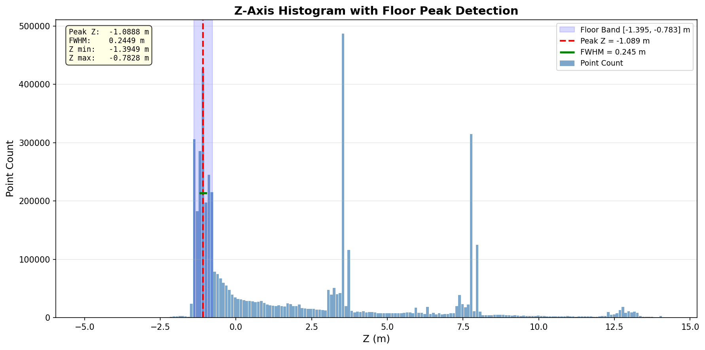 |

#### 3단계 필터링 퍼널

> 전체 포인트 → Z-필터 → Intensity/Color 정제를 거쳐 최종 바닥 포인트를 추출합니다.

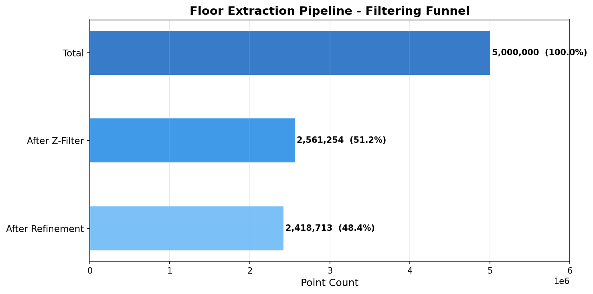

#### 바닥 비율

| Before (34.5%) | After (48.4%) |
|:---:|:---:|
| 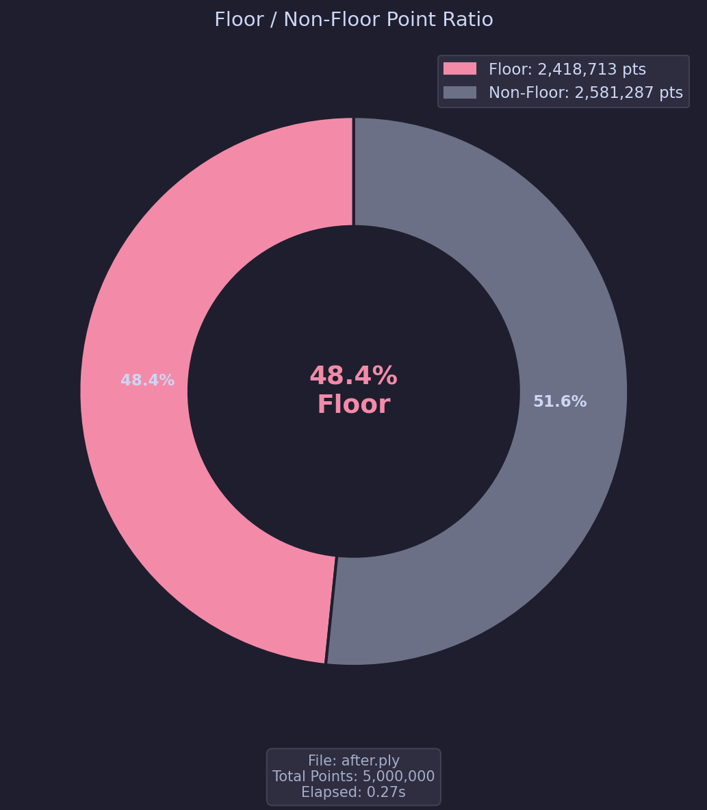 | 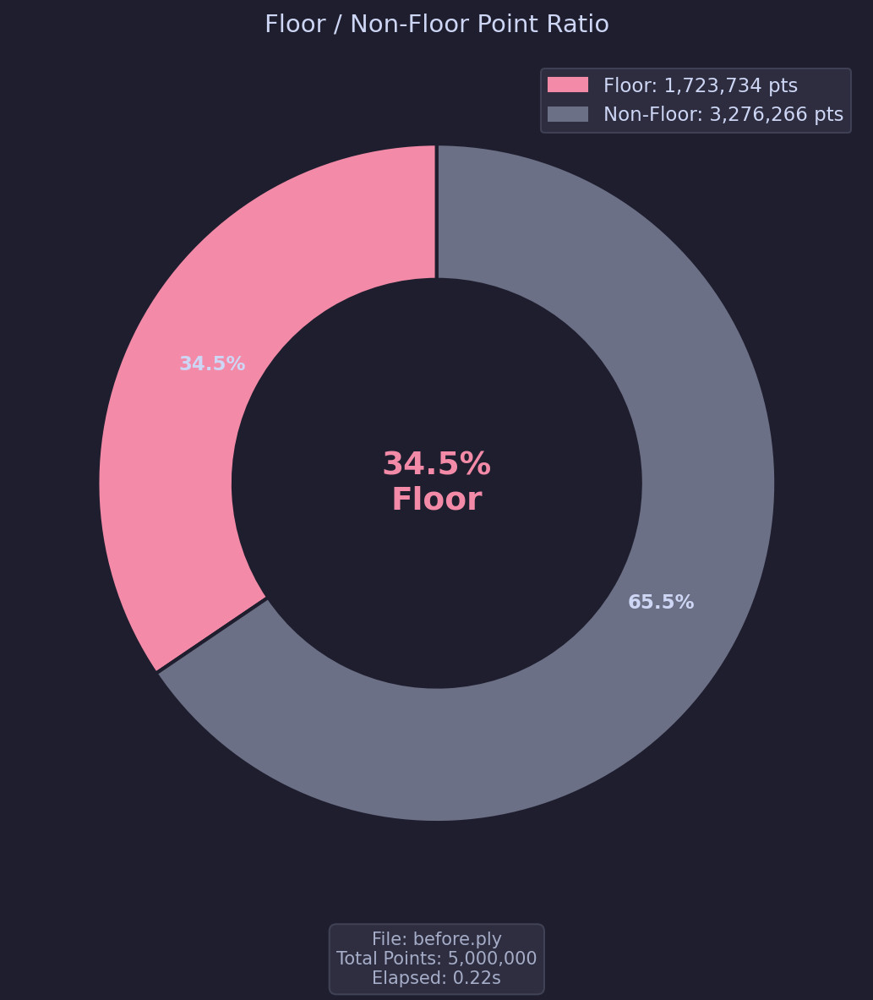 |

### 평탄도 분석

> 바닥 포인트를 그리드로 분할하여 각 셀의 기울기(Tilt)를 SVD 표면 법선으로 계산합니다.

| Before (평균 기울기 10.5°) | After (평균 기울기 16.0°) |
|:---:|:---:|
| 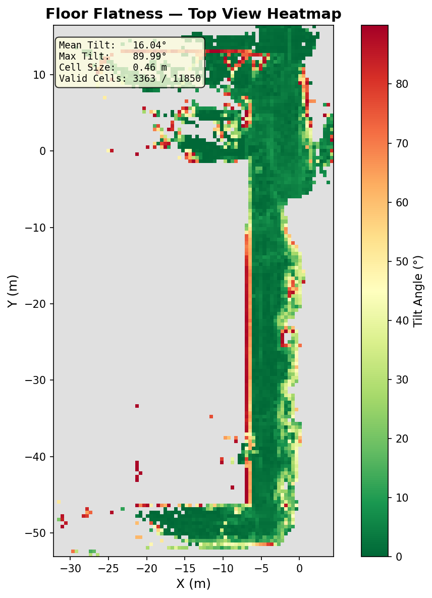 | 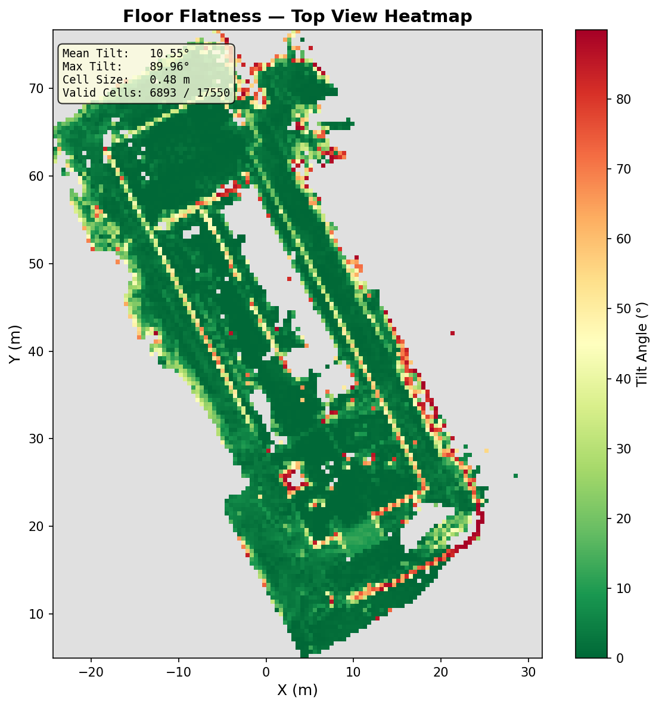 |

### 파라미터 민감도 분석

> width_multiplier, color_tolerance, intensity_percentile 3개 파라미터 변화에 따른 바닥 비율 변화를 분석합니다.

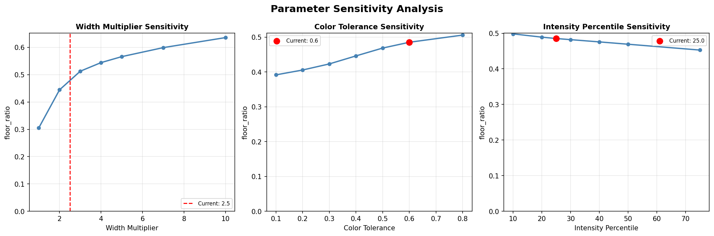

---

## 프로젝트 구조

```
airo-fitness/
├── src/
│   ├── main.py                  # CLI 진입점 (파일 선택 → 로딩 → 분석 → 시각화)
│   ├── config.py                # 중앙 설정 (Config 데이터클래스)
│   ├── loader/
│   │   └── ply_loader.py        # PLY 파일 스트리밍 로더 + 랜덤 샘플링
│   ├── extractor/
│   │   ├── peak_detector.py     # Z-히스토그램 피크 감지 (scipy.signal)
│   │   ├── floor_extractor.py   # 3단계 바닥 추출 파이프라인
│   │   └── flatness_analyzer.py # 그리드 기반 SVD 평탄도 분석
│   ├── viewer/
│   │   └── visualizer.py        # PyVista 3D 뷰어 (4 모드 + 스크린샷)
│   └── chart/
│       ├── chart_manager.py     # 7개 차트 + JSON 리포트 오케스트레이터
│       ├── z_histogram.py       # Z-값 분포 + 피크 오버레이
│       ├── filtering_funnel.py  # 3단계 필터링 퍼널 차트
│       ├── intensity_chart.py   # Intensity 히스토그램
│       ├── color_distance.py    # 색상 거리 히스토그램
│       ├── floor_ratio.py       # 바닥/비바닥 비율 도넛 차트
│       ├── parameter_sensitivity.py # 파라미터 민감도 라인 차트
│       ├── flatness_heatmap.py  # 평탄도 히트맵
│       └── report_writer.py     # JSON 리포트 생성기
├── data/                        # PLY 입력 파일 (git 미추적)
├── results/                     # 분석 결과 출력 (git 미추적)
├── docs/images/                 # README 에셋 이미지
├── Dockerfile
├── docker-compose.yaml
└── pyproject.toml
```

---

## 기술 스택

| 구분 | 기술 |
|------|------|
| 언어 | Python 3.14+ |
| 수치 연산 | NumPy 2.4+ |
| 신호 처리 | SciPy 1.17+ (피크 감지, SVD) |
| 3D 시각화 | PyVista 0.47+ (VTK 기반, GPU 가속) |
| 차트 | Matplotlib 3.10+ |
| 패키지 관리 | uv |
| 컨테이너 | Docker (CPU / GPU) |

---

## 설치 및 실행

### 사전 요구사항

- Python 3.14 이상
- [uv](https://docs.astral.sh/uv/) 패키지 매니저

### 로컬 실행

```bash
# 의존성 설치
uv sync

# 실행 (data/ 디렉토리에 PLY 파일 필요)
uv run python src/main.py
```

### Docker 실행

```bash
# CPU 모드
docker compose up -d airo-fitness
docker compose exec airo-fitness bash
cd airo-fitness && uv sync && uv run python src/main.py

# GPU 모드 (NVIDIA GPU 필요)
docker compose --profile gpu up -d airo-fitness-gpu
docker compose exec airo-fitness-gpu bash
cd airo-fitness && uv sync && uv run python src/main.py
```

---

## 실행 흐름

```
1. 파일 선택    data/ 디렉토리에서 PLY 파일 선택
       ↓
2. 스트리밍 로딩  청크 단위 읽기 + 랜덤 샘플링 (기본 500만 포인트)
       ↓
3. 바닥 추출    Z-히스토그램 피크 → Z-필터 → Intensity/Color 정제
       ↓
4. 차트 생성    7종 분석 차트 + JSON 리포트 → results/{timestamp}/
       ↓
5. 3D 시각화   PyVista GPU 렌더링 (키보드 인터랙션)
```

---

## 뷰어 조작법

| 키 | 동작 |
|----|------|
| `1` | Full Point Cloud — 전체 포인트 표시 |
| `2` | Floor Only — 바닥 포인트만 표시 |
| `3` | Non-Floor Only — 비바닥 포인트만 표시 |
| `4` | Highlighted Floor — 바닥을 빨간색으로 하이라이트 (기본) |
| `S` | 현재 모드의 5방향 스크린샷 캡처 (top, front, back, right, left) |

---

## 설정 파라미터

`src/config.py`의 `Config` 데이터클래스에서 모든 하이퍼파라미터를 관리합니다.

| 파라미터 | 기본값 | 설명 |
|----------|--------|------|
| `max_points` | 5,000,000 | 최대 샘플링 포인트 수 |
| `chunk_size` | 1,000,000 | 스트리밍 청크 크기 |
| `num_bins` | 200 | Z-히스토그램 빈 수 |
| `width_multiplier` | 2.5 | FWHM 기반 바닥 범위 배율 |
| `intensity_percentile` | 25.0 | Intensity 필터 퍼센타일 임계값 |
| `color_tolerance` | 0.6 | 색상 거리 허용치 |
| `flatness_target_grid` | 150 | 평탄도 분석 그리드 크기 |
| `point_size` | 1.0 | 3D 뷰어 포인트 렌더링 크기 |
| `chart_dpi` | 150 | 차트 이미지 해상도 |

---

## 분석 파이프라인 상세

### 1단계: Z-히스토그램 피크 감지

Z축 값의 히스토그램에서 `scipy.signal.find_peaks`로 바닥면 피크를 자동 감지합니다. FWHM(반치전폭)을 계산하여 바닥 Z 범위를 결정합니다. 기울어진 바닥의 경우 틸트 보정이 적용됩니다.

### 2단계: Z-범위 필터링

감지된 피크의 Z 범위(`peak_z ± FWHM × width_multiplier`)에 해당하는 포인트를 1차 필터링합니다.

### 3단계: Intensity/Color 정제

- **Intensity 필터**: 바닥 포인트의 intensity 분포에서 하위 퍼센타일 이하 제거
- **Color 필터**: 바닥 포인트의 중앙 색상 대비 거리가 임계값 초과인 포인트 제거

### 평탄도 분석

바닥 포인트를 X-Y 그리드로 분할한 후, 각 셀에서 SVD(특이값 분해)로 표면 법선 벡터를 추정합니다. 법선 벡터와 Z축 사이의 각도가 해당 셀의 기울기(Tilt)입니다.

---

## 출력 결과물

`results/{timestamp}/` 디렉토리에 다음 파일들이 생성됩니다:

| 파일 | 설명 |
|------|------|
| `01_z_histogram_peak.png` | Z-히스토그램 + 피크 오버레이 |
| `02_filtering_funnel.png` | 3단계 필터링 퍼널 차트 |
| `03_intensity_histogram.png` | Intensity 분포 히스토그램 |
| `04_color_distance.png` | 색상 거리 히스토그램 |
| `05_floor_ratio.png` | 바닥/비바닥 비율 도넛 차트 |
| `06_parameter_sensitivity.png` | 파라미터 민감도 분석 |
| `07_flatness_heatmap.png` | 평탄도 히트맵 |
| `report.json` | 분석 메타데이터 + 통계 리포트 |
